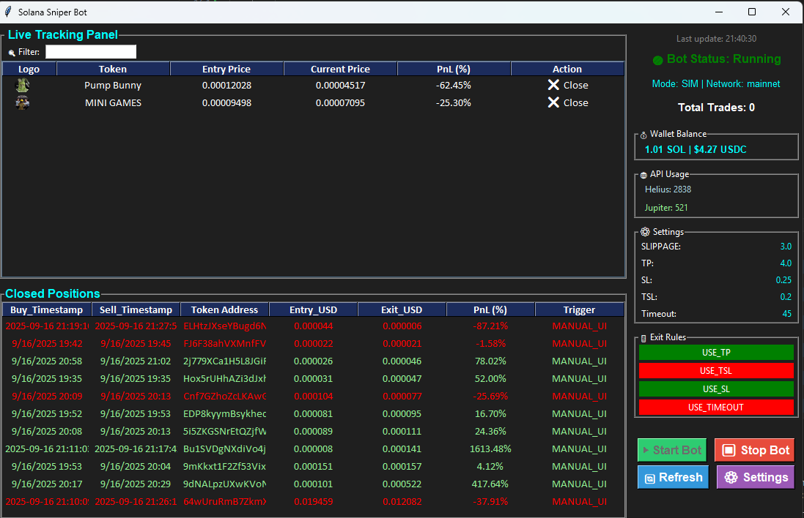
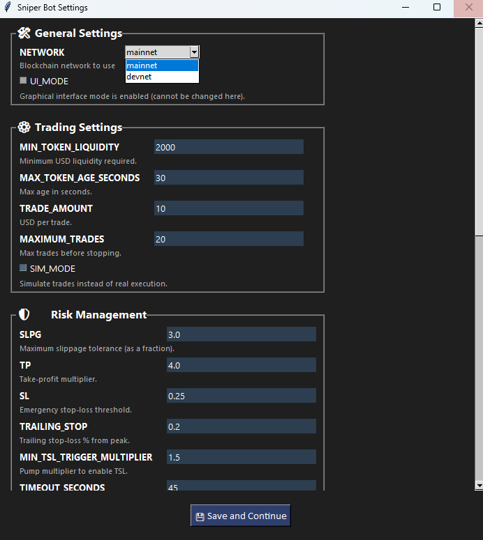
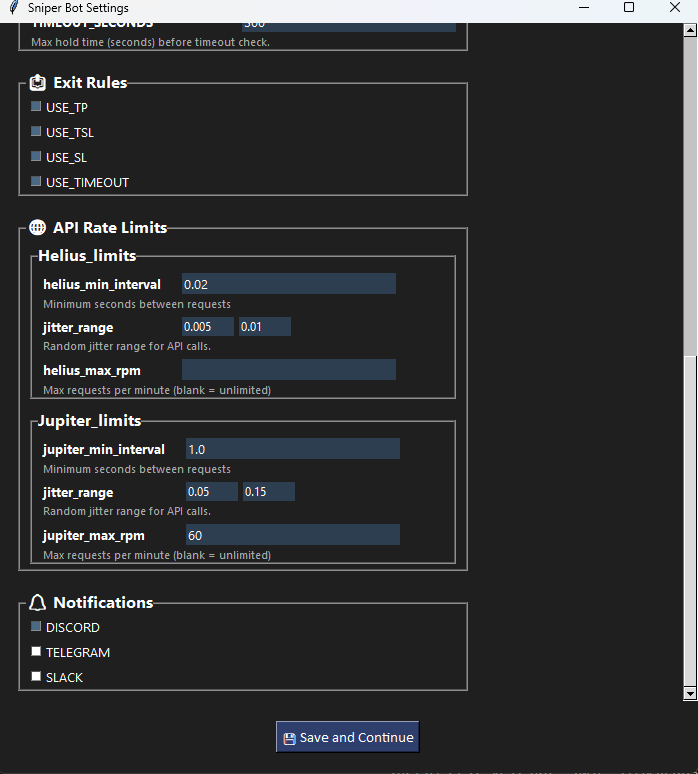

# Automated Solana Sniper Bot

    
  

## Overview  

**Automated Solana Sniper Bot** is a hybrid system that combines **real-time token detection (sniper)** with a robust **automated trading and position-management** engine.

- The *detection layer* listens to Helius WebSocket / DEX logs (Raydium, Pump.fun, etc.) and emits buy signals for newly launched or changed tokens.
- The *execution layer* (this repo’s `buy()` and related functions) can **simulate** or **execute** trades via Jupiter, handling quoting, transaction construction and posting.
- The *tracking layer* monitors open positions, applies exit rules (TP / SL / TSL / timeout), logs trades, and retries failed sells.

This repository is therefore a **hybrid sniper + automated trading framework** — it detects candidate tokens quickly and then manages trades safely and reliably after purchase. 

---

## Table of Contents  

- [Screenshots](#screenshots)  
- [Prerequisites](#prerequisites)  
- [Features](#features)  
- [Requirements](#requirements)  
- [Config Files Overview](#config-files-overview)  
- [Installation](#installation)  
- [Running the Bot](#running-the-bot)  
- [Configuration](#Configuration `bot_settings.py`)  
- [Roadmap](#roadmap)  
- [Log Management](#log-management)  
- [Log Summarization Tool](#log-summarization-tool)  
- [Disclaimer](#disclaimer)  
- [License](#license)  

---
## Important Notes

- Make sure `bot_settings.json` is properly configured before using `--server` mode.
- Your private key and API keys are loaded from environment variables or `.env`/JSON securely.
- All trades in **simulation** unless you explicitly disable `SIM_MODE` in the settings.
- SIM_MODE still connects to mainnet and fetches real Jupiter quotes, so price and output values are accurate
  - Difference: it does not broadcast a transaction or spend SOL.
  - Instead, it logs a SIMULATED_BUY to CSV with calculated entry price and tokens received.
  - slippage and mevbot not included so pnl will be abit off
- Use mainnet only when ready for real trading; devnet is for testing only
- Post-buy Tracking implemented not but not integrated yet under testing

## Screenshots  

### UI Dashboard (Live Trading View)  
  

Shows bot status, wallet balance, API usage, trade settings, and real-time closed positions with PnL tracking.  

### UI Settings  
    

Configuration panel for setting TP, SL, TSL, timeout, and enabling/disabling exit rules.  


---

## Prerequisites  

You'll need the following before running the bot:  

- A funded Solana wallet  
- A Helius API Key (WebSocket + REST access)  
- A SOLANA_PRIVATE_KEY — wallet key  
- A Discord bot token — for notifications  
- A BirdEye API Key (for liquidity & price fallback) (Optional)   

---


## Features  

- Real-Time Token Detection 
- Excel Logging System  
  - `results/tokens/all_tokens_found.csv` — All detected tokens  
  - `results/tokens/post_buy_checks.csv` — Tokens flagged during post-buy safety checks (LP lock, holders, volume, market cap)  
  - `tokens_to_track/tokens/simulated_tokens.csv` — Active simulated token positions  
  - `tokens_to_track/tokens/simulated_closed_positions.csv` — Simulated sells and PnL logs  
  - `tokens_to_track/tokens/open_positions.csv` — (If applicable) active real trades  
  - `tokens_to_track/tokens/closed_positions.csv` — (If applicable) completed real trades  
  - `tokens_to_track/tokens/failed_sells.csv` — Failed sell attempts after retries  
  - `results/tokens/Pair_keys.csv` — Stores token-to-pool mapping (with DEX info and migration status)  
  - `results/tokens/token_volume.csv` — Launch snapshot + tracked USD volume per token  
  - `logs/matched_logs/<token>.log` — Log summary per token from `analyze.py`  

- Scam Protection  
  - Mint/freeze authority audit  
  - Honeypot & zero-liquidity protection  
  - Tax check and centralized holder detection  
  - Rug-pull risk detection (LP lock, mutability)  

- Automated Execution via Jupiter (simulate or send transactions)  
  - Buy/sell via Jupiter using signed base64 transactions  
  - Auto buy mode  
  - Handles associated token accounts automatically  

- Post-buy Tracking & Exit Rules (TP/SL/TSL/Timeout)  
  - Retry safety checks (e.g., LP unlock, holder distribution)  
  - Live tracking of token price vs entry price (TP / SL / TSL / Timeout)  

- Post-Buy Safety Checks  
  - Liquidity pool lock & mutability check  
  - Centralized holder distribution audit  
  - Market cap validation  
  - Experimental volume-based filters (not fully integrated yet)  

- Logging & Reporting  
  - CSV-based trade history and analysis  
  - Retry failed sells with configurable limits  

- Notifications  
  - Discord alerts (live safe token alerts with price + metadata)  
  - Planned: Telegram & Slack integration  

- Threaded Execution  
  - WebSocket, transaction fetcher, position tracker, and notifier run concurrently  

- Log Summarization Tool (`run_analyze.py`)  
  - Extracts time-sorted logs per token for deep analysis  
  - Removes duplicates, merges info/debug, and creates human-readable `.log` files  

### Experimental Features  
- Volume Tracking (work in progress)  
- Backup Chain Price Source and Birdeye (added, not fully integrated)  


---

## Requirements  

- Python 3.8+  
- Key packages:  
  `solana`, `solders`, `pandas`, `requests`, `websocket-client`  

---

## Config Files Overview  


| File | Purpose |  
|------|---------|  
| `config/bot_settings.py` | Core parameters (TP/SL, liquidity threshold, SIM mode, rate limits) |  
| `config/dex_detection_rules.py` | Per-DEX rules for token validation |  
| `config/blacklist.py` | Known scam or blocked token addresses |  
| `config/network.py` | Solana network constants and RPC endpoint mapping |  
| `config/third_parties.py` | Third-party endpoints (Jupiter, BirdEye, dexscreener) |  
| `helpers/bot_context.py` | Central context manager (API keys, settings, shared state) |  
| `credentials.sh` / `.ps1` / `.sh` | Stores API keys and private key exports (Helius,  Discord token, SOL private key, BirdEye).|


---
### Credentials & Secrets

The bot requires several private credentials (Helius API key, SOL private key, Discord bot token, optional BirdEye key). These should be provided via environment variables, a local `credentials.sh`/PowerShell script, or a `.sh` file — **never commit them to source control**.
```bash
export HELIUS_API_KEY=''
export SOLANA_PRIVATE_KEY=''
export DISCORD_TOKEN=''
export BIRD_EYE=''
export DEX=''
```


## Installation  

```bash
git clone https://github.com/AintSmurf/Solana_sniper_bot.git
cd Solana_sniper_bot
python -m venv venv
source venv/bin/activate   # On Linux/macOS
venv\Scripts\activate      # On Windows
pip install -r requirements.txt
```

## Running the Bot

The bot can be launched in three main modes: UI, CLI, and Server
On the first run, it will also prompt you to choose your preferred mode and configure settings
---

### First Run (No bot_settings.json yet)

```bash
python app.py 
```

- When you run the bot for the first time:
  ```
  First run detected — launch with graphical UI? (y/N):
  ```
  - If you choose yes → the tkinter UI will open
  - If you choose no → the bot runs in CLI mode and will also prompt you for initial settings (e.g., liquidity, trade amount, thresholds)
  - Your answers will be saved to bot_settings.json (unless you pass --no-save)
---
### UI Mode (Graphical Interface)

```bash
python app.py --ui
```

- Forces the bot to run in the terminal only, ignoring UI settings
- Useful for configuration and live monitoring
- **Recommended** for beginners or for manual supervision of the bot

---

### CLI Mode (Interactive Terminal)

```bash
python app.py --cli
```

- Forces the bot to run in the terminal only, ignoring UI settings
- Displays logs, buys, and sells in real time
- Sends alerts to Discord (if configured)
---

### Server Mode (Headless / No Prompts)

```bash
python app.py --s or python app.py --server 
```

- Runs in headless CLI mode with zero prompts, even on first run
- Uses whatever is saved in bot_settings.json
- Ideal for **cloud servers, VPS, or Docker containers**
- Auto-shutdown happens after `MAXIMUM_TRADES` is reached unless customized.
- If bot_settings.json does not exist, a new one will be created using default settings

---

### Temporary Overrides (Without Saving)

```bash
python app.py --ui --no-save
```

- Launches in UI mode just for this run, but does not overwrite the saved UI_MODE in bot_settings.json
- Works with --ui, --cli

---

## Configuration `bot_settings.py`

```python
{
    #Solana blockchain mainnet- real, devnet-development/test network
    "NETWORK":"mainnet"
    
    # Whether to run the bot with a UI (tkinter dashboard)
    "UI_MODE": False,

    # Minimum liquidity required (USD) to consider a token worth trading
    "MIN_TOKEN_LIQUIDITY": 10000,

    # Maximum token age (in seconds) to be considered "fresh"
    "MAX_TOKEN_AGE_SECONDS": 30,

    # Amount (in USD) per trade (simulation or real)
    "TRADE_AMOUNT": 10,

    # Max number of trades before the bot shuts down
    "MAXIMUM_TRADES": 20,

    # True = simulation mode, False = real trading
    "SIM_MODE": True,

    # Timeout conditions
    "TIMEOUT_SECONDS": 180,           # After 180s, check if profit threshold met
    "TIMEOUT_PROFIT_THRESHOLD": 1.03, # If < +3% profit → force exit

    # Take profit and stop loss rules
    "SLPG": 3.0,                      # SLPG is a percent expressed as a float (e.g. 3.0 = 3%). The bot converts SLPG → slippageBps for Jupiter by int(SLPG * 100) (so 3.0 → 300 bps).
    "TP": 4.0,                        # +300% (4x entry)
    "SL": 0.25,                       # 25% drop from entry
    "TRAILING_STOP": 0.2,             # 20% below peak price
    "MIN_TSL_TRIGGER_MULTIPLIER": 1.5,# TSL only kicks in after 1.5x

    # Exit rule toggles
    "EXIT_RULES": {
        "USE_TP": False,
        "USE_TSL": False,
        "USE_SL": False,
        "USE_TIMEOUT": False
    },

    # Notification channels
    "NOTIFY": {
        "DISCORD": False,
        "TELEGRAM": False,
        "SLACK": False,
    },

    # API rate limits
    "RATE_LIMITS": {
        "helius": {
            "min_interval": 0.02,             # seconds between requests
            "jitter_range": [0.005, 0.01],    # randomness to avoid bursts
            "max_requests_per_minute": None,  # unlimited
            "name": "Helius_limits"
        },
        "jupiter": {
            "min_interval": 1.1,              # seconds between requests
            "jitter_range": [0.05, 0.15],     # randomness to avoid bursts
            "max_requests_per_minute": 60,    # requests per minute
            "name": "Jupiter_limits"
        }
    }
}

```

##  Docker Setup 
- You can run the bot inside Docker using the provided **Dockerfile.bot**
  - Configure credentials in Credentials.sh (or use environment variables)
  ```env
    HELIUS_API_KEY=your_helius_api_key
    SOLANA_PRIVATE_KEY=your_base58_private_key 
    DISCORD_TOKEN=your_discord_bot_token 
    BIRD_EYE_API_KEY=your_birdeye_key (optional)
    DEX="Pumpfun" or "Raydium"
    ```
  - Prepare settings
    Since Docker runs the bot with the --s (server) flag, there are no prompts.
    Make sure a valid bot_settings.json is already present in your project.
      - If bot_settings.json is missing, Docker will create one with default settings.
      - It’s recommended to configure it locally first and then mount it into the container.
  - Build the Docker image
    ```bash
    docker build -f Dockerfile.bot -t solana-sniper-bot
    ```
  - Step 3: Run the bot inside Docker
    ```bash
    docker run solana-sniper-bot
    ```

## Roadmap

- **Backup Price Source (Birdeye / on chain / - fallback, added but not fully integrated)** — Secondary price feeds to ensure reliability when Jupiter or Helius rates fail.  

- **Volume Tracking (beta)** — Tracks USD inflows/outflows per token to identify hype and unusual activity.  
  - Currently saves snapshots but accuracy still needs improvement.  

- **Blacklist / Whitelist automated detection (planned)** — Automatically flags suspicious tokens or prioritizes trusted ones.  
  - Integrated into detection and exit rule checks.  

- **SQL Logging (planned)** — Replace CSV-based trade logs with a structured SQLite database.  
  - Easier querying, analysis, and historical insights.  

- **Telegram Notifications (planned)** — Send trade alerts, errors, and detection events to Telegram channels.  

- **Slack Notifications (planned)** — Push alerts and trading activity into Slack workspaces.  

- **Web Dashboard (planned)** — A lightweight web UI for remote monitoring and control.  
  - Real-time feeds: detection events, open positions, closed positions, and logs.  
  - Live charts for PnL and token price history.  
  - Remote controls: start/stop bot, trigger manual sell, adjust trading settings.  

- **Track tokens by address (planned)** — Add tokens to a watchlist by mint address (manual or via detection).  
  - Watchlist supports per-token overrides (custom TP/SL, trade size, whitelist/blacklist).  
  - Watchlist shown in UI and accessible from the web dashboard or CLI.  
- **Automated Tests (pytest)** — unit and integration tests for buy/sell flows, volume tracking, and context initialization.


## Log Management

Logs are organized for clarity and traceability:
| File                             | Description                              |
| -------------------------------- | ---------------------------------------- |
| `logs/info.log`                  | General info/debug logs                  |
| `logs/debug.log`                 | Developer-focused debug logs             |
| `logs/console_logs/console.info` | Simplified console view                  |
| `logs/special_debug.log`         | Critical debug logs (e.g. scam analysis) |

---

## Log Summarization Tool

This tool allows you to extract, clean, and analyze logs for one or multiple token addresses and transaction signatures.

###  Functionality

- Searches across:
  - `logs/debug/`
  - `logs/backup/debug/`
  - `logs/info.log`
- Matches logs by:
  - `--signature` (transaction signature)
  - `--token` (mint address)
- Removes duplicate or overlapping lines
- Sorts all matched logs chronologically
- Outputs a clean, consolidated log to: logs/matched_logs/<token_address>.log
### Manual Usage (One Token)
To analyze a **single** token and transaction:

```bash
python analyze.py --signature <txn_signature> --token <token_address>
```
To analyze all tokens in parallel from your results:

```bash
python run_analyze.py 
```
- explanation
  - Reads results/tokens/all_tokens_found.csv
  - Extracts logs for each Signature and Token Mint pair
  - Runs `analyze.py` in parallel subprocesses 
    - (uses `max_workers=10` by default; 
    - actual concurrency depends on your CPU)


## Disclaimer

This project is intended for **educational and research purposes only**. Automated trading involves financial risk. You are solely responsible for how you use this software. No guarantees are made regarding financial return or token accuracy.

---

## License

This project is licensed under the [MIT License](LICENSE).

